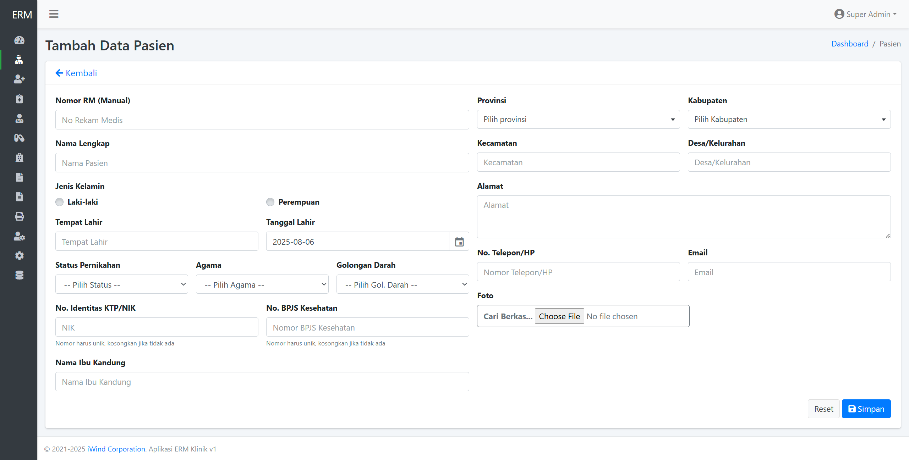
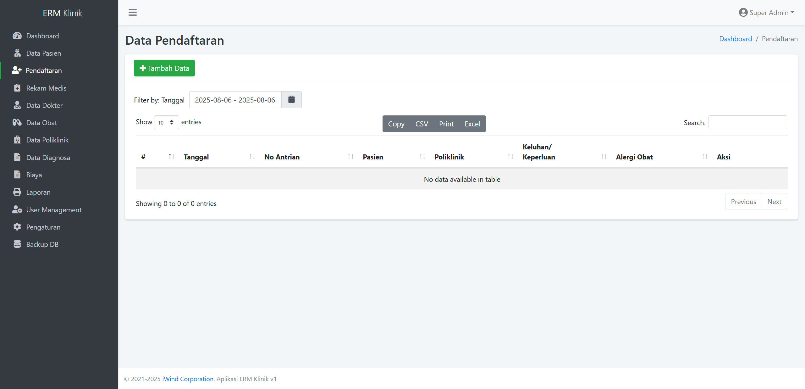
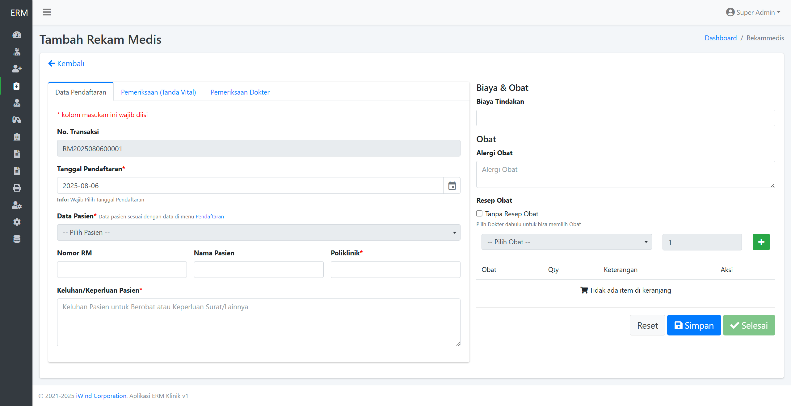
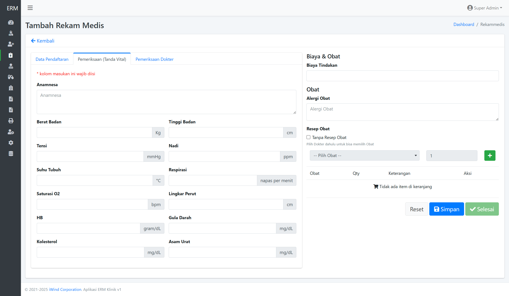
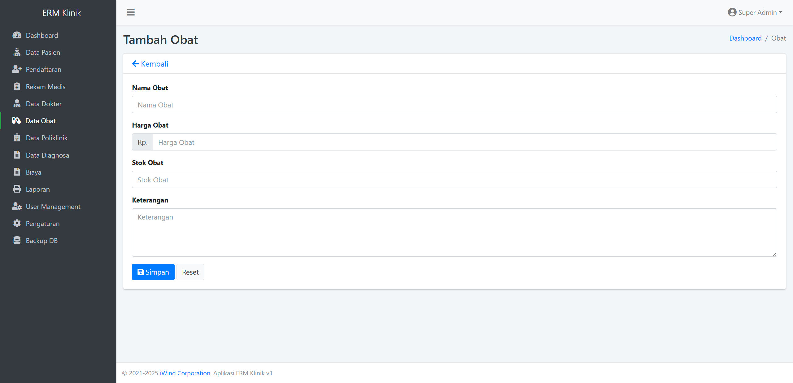
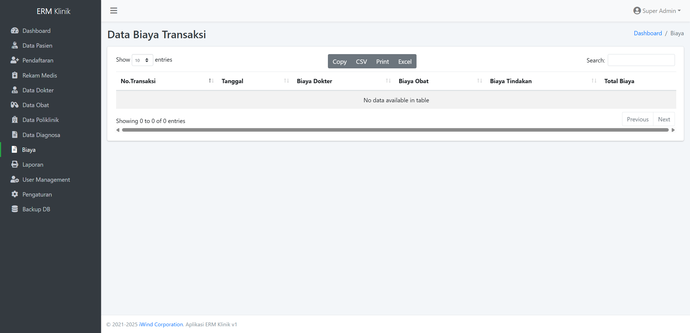
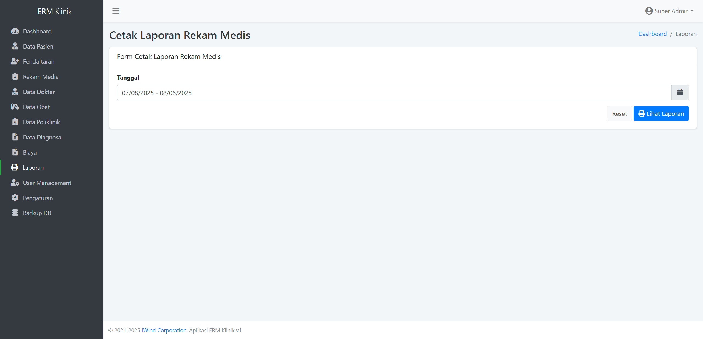
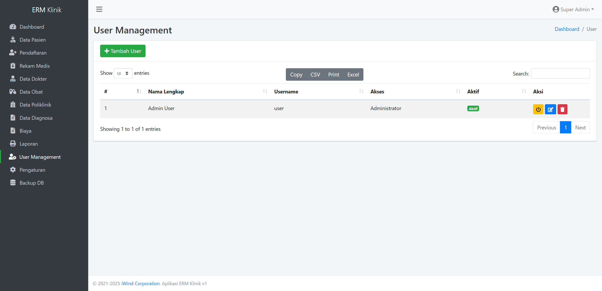

# PANDUAN PENGGUNA SISTEM INFORMASI MANAJEMEN KLINIK
## PT. IWIND CORPORATION

    

## Daftar Isi
1. [Pendahuluan](#1-pendahuluan)
2. [Memulai Aplikasi](#2-memulai-aplikasi)
3. [Dashboard](#3-dashboard)
4. [Manajemen Pasien](#4-manajemen-pasien)
5. [Pendaftaran Pasien](#5-pendaftaran-pasien)
6. [Rekam Medis](#6-rekam-medis)
7. [Manajemen Dokter](#7-manajemen-dokter)
8. [Manajemen Obat](#8-manajemen-obat)
9. [Manajemen Poliklinik](#9-manajemen-poliklinik)
10. [Diagnosa](#10-diagnosa)
11. [Manajemen Biaya](#11-manajemen-biaya)
12. [Laporan](#12-laporan)
13. [Manajemen Pengguna](#13-manajemen-pengguna)
14. [Backup Data](#14-backup-data)

## 1. Pendahuluan

Sistem Informasi Manajemen Klinik (SIM Klinik) adalah aplikasi berbasis web yang dirancang untuk memudahkan proses administrasi dan manajemen di klinik kesehatan. Sistem ini mencakup berbagai fitur seperti pendaftaran pasien, rekam medis, manajemen dokter, manajemen obat, manajemen biaya, dan pembuatan laporan.

Panduan ini akan membantu Anda memahami cara menggunakan setiap fitur yang tersedia dalam SIM Klinik dengan efektif dan efisien.

### 1.1 Persyaratan Sistem

Untuk menggunakan SIM Klinik, Anda memerlukan:
- Komputer atau perangkat dengan koneksi internet
- Browser web modern (Google Chrome, Mozilla Firefox, Microsoft Edge, atau Safari versi terbaru)
- Akun pengguna yang telah terdaftar dalam sistem

### 1.2 Konvensi dalam Dokumen

Dalam panduan ini, kami menggunakan konvensi berikut:
- **Cetak tebal**: Untuk menu, tombol, dan elemen antarmuka lainnya
- *Cetak miring*: Untuk istilah penting atau kata kunci
- `Teks kode`: Untuk URL atau input khusus

## 2. Memulai Aplikasi

### 2.1 Login ke Sistem

1. Buka browser web Anda dan akses alamat SIM Klinik (misalnya: http://demo-klinik.iwindcorporation.com)
2. Masukkan username dan password yang telah diberikan oleh administrator
3. Klik tombol **Login**

### 2.2 Mengubah Password

1. Setelah login, klik nama pengguna Anda di pojok kanan atas
2. Pilih **Ubah Password**
3. Masukkan password lama dan password baru
4. Klik **Simpan** untuk menyimpan perubahan

## 3. Dashboard

**Gambar 3.1** - Tampilan Dashboard SIM Klinik

Dashboard SIM Klinik menampilkan ringkasan informasi penting tentang operasional klinik, seperti:

1. **Menu Navigasi** - Terletak di sebelah kiri layar, berisi akses ke seluruh modul sistem
2. **Statistik Harian** - Menampilkan jumlah kunjungan pasien hari ini
3. **Grafik Kunjungan** - Menampilkan tren kunjungan pasien dalam periode tertentu
4. **Informasi Dokter Bertugas** - Menampilkan dokter yang sedang bertugas hari ini
5. **Notifikasi** - Pemberitahuan tentang aktivitas penting dalam sistem

### 3.1 Navigasi Sistem

Untuk mengakses fitur-fitur dalam SIM Klinik, gunakan menu navigasi di sebelah kiri layar. Menu ini berisi:
- Dashboard
- Pasien
- Pendaftaran
- Rekam Medis
- Dokter
- Obat
- Poliklinik
- Diagnosa
- Biaya
- Laporan
- User
- Backup

## 4. Manajemen Pasien

### 4.1 Melihat Daftar Pasien

**Gambar 4.1** - Tampilan Daftar Pasien

Halaman Daftar Pasien menampilkan semua pasien yang terdaftar di klinik. Fitur pada halaman ini meliputi:

1. **Pencarian** - Mencari pasien berdasarkan nama, nomor rekam medis, atau informasi lainnya
2. **Pengurutan** - Mengurutkan daftar berdasarkan nama, tanggal pendaftaran, dll.
3. **Filter** - Menyaring pasien berdasarkan kriteria tertentu
4. **Tombol Tambah Pasien** - Untuk mendaftarkan pasien baru
5. **Tombol Aksi** - Untuk melihat detail, mengedit, atau menghapus data pasien

### 4.2 Menambahkan Pasien Baru

**Gambar 4.2** - Form Tambah Pasien Baru

Untuk menambahkan pasien baru:

1. Klik tombol **Tambah Pasien** pada halaman Daftar Pasien
2. Isi formulir dengan data pasien:
   - Nomor Rekam Medis (otomatis terisi)
   - Nama Lengkap
   - Jenis Kelamin
   - Tanggal Lahir
   - Alamat
   - Nomor Telepon
   - Informasi tambahan lainnya
3. Klik tombol **Simpan** untuk mendaftarkan pasien baru

### 4.3 Mengedit Data Pasien

Untuk mengedit data pasien:
1. Temukan pasien yang ingin diubah datanya di Daftar Pasien
2. Klik tombol **Edit** (ikon pensil) pada kolom Aksi
3. Ubah informasi yang diperlukan pada formulir Edit Pasien
4. Klik **Simpan** untuk menyimpan perubahan

### 4.4 Menghapus Data Pasien

Untuk menghapus data pasien:
1. Temukan pasien yang ingin dihapus di Daftar Pasien
2. Klik tombol **Hapus** (ikon tempat sampah) pada kolom Aksi
3. Konfirmasi penghapusan pada dialog yang muncul
4. Klik **OK** untuk menghapus data pasien

## 5. Pendaftaran Pasien

### 5.1 Melihat Daftar Pendaftaran

**Gambar 5.1** - Tampilan Daftar Pendaftaran

Halaman Pendaftaran menampilkan daftar pasien yang mendaftar untuk kunjungan medis. Fitur pada halaman ini meliputi:

1. **Filter Tanggal** - Untuk melihat pendaftaran pada tanggal tertentu
2. **Pencarian** - Mencari pendaftaran berdasarkan nama pasien atau informasi lainnya
3. **Status Pendaftaran** - Menampilkan status dari setiap pendaftaran (menunggu, sedang diperiksa, selesai)
4. **Tombol Tambah Pendaftaran** - Untuk mendaftarkan kunjungan baru

### 5.2 Menambahkan Pendaftaran Baru

**Gambar 5.2** - Form Tambah Pendaftaran

Untuk mendaftarkan kunjungan pasien:

1. Klik tombol **Tambah Pendaftaran** pada halaman Daftar Pendaftaran
2. Pilih pasien dari daftar yang ada atau klik **Pasien Baru** jika pasien belum terdaftar
3. Pilih poliklinik tujuan
4. Pilih dokter yang akan memeriksa
5. Masukkan keluhan utama pasien
6. Pilih jenis kunjungan (umum, BPJS, asuransi, dll.)
7. Klik **Simpan** untuk menyelesaikan pendaftaran

### 5.3 Mengubah Status Pendaftaran

Untuk mengubah status pendaftaran:
1. Temukan pendaftaran yang ingin diubah statusnya di Daftar Pendaftaran
2. Klik tombol **Ubah Status** pada kolom Aksi
3. Pilih status baru (menunggu, sedang diperiksa, selesai)
4. Klik **Simpan** untuk menyimpan perubahan

## 6. Rekam Medis

### 6.1 Melihat Daftar Rekam Medis

**Gambar 6.1** - Tampilan Daftar Rekam Medis

Halaman Rekam Medis menampilkan catatan medis pasien. Fitur pada halaman ini meliputi:

1. **Pencarian** - Mencari rekam medis berdasarkan nama pasien atau nomor rekam medis
2. **Filter Tanggal** - Melihat rekam medis pada periode tertentu
3. **Tombol Tambah Rekam Medis** - Untuk membuat catatan rekam medis baru
4. **Tombol Aksi** - Untuk melihat detail, mengedit, atau mencetak rekam medis

### 6.2 Membuat Rekam Medis Baru

**Gambar 6.2** - Form Tambah Rekam Medis (Langkah 1)

**Gambar 6.3** - Form Tambah Rekam Medis (Langkah 2)

**Gambar 6.4** - Form Tambah Rekam Medis (Langkah 3)

Untuk membuat rekam medis baru:

1. Klik tombol **Tambah Rekam Medis** pada halaman Daftar Rekam Medis
2. Pilih pasien dari daftar pendaftaran atau cari pasien
3. Isi formulir dengan informasi medis:
   - Anamnesis (keluhan utama dan riwayat penyakit)
   - Pemeriksaan fisik (tekanan darah, suhu, dll.)
   - Diagnosa (dapat memilih dari daftar ICD-10)
   - Tindakan medis yang dilakukan
   - Obat yang diresepkan
4. Klik **Lanjutkan** untuk melanjutkan ke halaman berikutnya
5. Pilih obat yang diresepkan dan masukkan dosisnya
6. Klik **Lanjutkan** untuk melanjutkan ke halaman berikutnya
7. Verifikasi seluruh data rekam medis
8. Klik **Simpan** untuk menyimpan rekam medis

### 6.3 Melihat Riwayat Rekam Medis Pasien

Untuk melihat riwayat rekam medis pasien:
1. Temukan pasien di Daftar Pasien
2. Klik tombol **Lihat Rekam Medis** pada kolom Aksi
3. Sistem akan menampilkan daftar kunjungan medis pasien tersebut
4. Klik pada kunjungan tertentu untuk melihat detail rekam medis

### 6.4 Mencetak Rekam Medis

Untuk mencetak rekam medis:
1. Temukan rekam medis yang ingin dicetak di Daftar Rekam Medis
2. Klik tombol **Cetak** pada kolom Aksi
3. Sistem akan menampilkan pratinjau dokumen rekam medis
4. Klik **Print** untuk mencetak dokumen

## 7. Manajemen Dokter

### 7.1 Melihat Daftar Dokter

**Gambar 7.1** - Tampilan Daftar Dokter

Halaman Dokter menampilkan daftar dokter yang praktik di klinik. Fitur pada halaman ini meliputi:

1. **Pencarian** - Mencari dokter berdasarkan nama atau spesialisasi
2. **Pengurutan** - Mengurutkan daftar berdasarkan nama atau spesialisasi
3. **Tombol Tambah Dokter** - Untuk menambahkan dokter baru
4. **Tombol Aksi** - Untuk melihat detail, mengedit, atau menghapus data dokter

### 7.2 Menambahkan Dokter Baru

**Gambar 7.2** - Form Tambah Dokter

Untuk menambahkan dokter baru:

1. Klik tombol **Tambah Dokter** pada halaman Daftar Dokter
2. Isi formulir dengan data dokter:
   - Nama Lengkap
   - Spesialisasi
   - Nomor SIP (Surat Izin Praktik)
   - Nomor Telepon
   - Email
   - Jadwal Praktik
   - Informasi tambahan lainnya
3. Klik **Simpan** untuk menambahkan dokter baru

### 7.3 Mengedit Data Dokter

Untuk mengedit data dokter:
1. Temukan dokter yang ingin diubah datanya di Daftar Dokter
2. Klik tombol **Edit** (ikon pensil) pada kolom Aksi
3. Ubah informasi yang diperlukan pada formulir Edit Dokter
4. Klik **Simpan** untuk menyimpan perubahan

### 7.4 Menghapus Data Dokter

Untuk menghapus data dokter:
1. Temukan dokter yang ingin dihapus di Daftar Dokter
2. Klik tombol **Hapus** (ikon tempat sampah) pada kolom Aksi
3. Konfirmasi penghapusan pada dialog yang muncul
4. Klik **OK** untuk menghapus data dokter

## 8. Manajemen Obat

### 8.1 Melihat Daftar Obat

**Gambar 8.1** - Tampilan Daftar Obat

Halaman Obat menampilkan daftar obat yang tersedia di klinik. Fitur pada halaman ini meliputi:

1. **Pencarian** - Mencari obat berdasarkan nama atau jenis
2. **Filter** - Menyaring obat berdasarkan kategori atau ketersediaan
3. **Tombol Tambah Obat** - Untuk menambahkan obat baru
4. **Informasi Stok** - Menampilkan jumlah stok yang tersedia
5. **Tombol Aksi** - Untuk melihat detail, mengedit, atau menghapus data obat

### 8.2 Menambahkan Obat Baru

**Gambar 8.2** - Form Tambah Obat

Untuk menambahkan obat baru:

1. Klik tombol **Tambah Obat** pada halaman Daftar Obat
2. Isi formulir dengan data obat:
   - Nama Obat
   - Jenis/Kategori Obat
   - Satuan (tablet, botol, ampul, dll.)
   - Jumlah Stok
   - Harga
   - Tanggal Kadaluarsa
   - Informasi tambahan lainnya
3. Klik **Simpan** untuk menambahkan obat baru

### 8.3 Mengedit Data Obat

Untuk mengedit data obat:
1. Temukan obat yang ingin diubah datanya di Daftar Obat
2. Klik tombol **Edit** (ikon pensil) pada kolom Aksi
3. Ubah informasi yang diperlukan pada formulir Edit Obat
4. Klik **Simpan** untuk menyimpan perubahan

### 8.4 Menghapus Data Obat

Untuk menghapus data obat:
1. Temukan obat yang ingin dihapus di Daftar Obat
2. Klik tombol **Hapus** (ikon tempat sampah) pada kolom Aksi
3. Konfirmasi penghapusan pada dialog yang muncul
4. Klik **OK** untuk menghapus data obat

### 8.5 Manajemen Stok Obat

Untuk mengelola stok obat:
1. Temukan obat yang ingin dikelola stoknya di Daftar Obat
2. Klik tombol **Kelola Stok** pada kolom Aksi
3. Pilih jenis transaksi (masuk atau keluar)
4. Masukkan jumlah dan keterangan
5. Klik **Simpan** untuk mencatat transaksi stok

## 9. Manajemen Poliklinik

### 9.1 Melihat Daftar Poliklinik

**Gambar 9.1** - Tampilan Daftar Poliklinik

Halaman Poliklinik menampilkan daftar poliklinik yang tersedia di klinik. Fitur pada halaman ini meliputi:

1. **Pencarian** - Mencari poliklinik berdasarkan nama
2. **Tombol Tambah Poliklinik** - Untuk menambahkan poliklinik baru
3. **Tombol Aksi** - Untuk melihat detail, mengedit, atau menghapus data poliklinik

### 9.2 Menambahkan Poliklinik Baru

**Gambar 9.2** - Form Tambah Poliklinik

Untuk menambahkan poliklinik baru:

1. Klik tombol **Tambah Poliklinik** pada halaman Daftar Poliklinik
2. Isi formulir dengan data poliklinik:
   - Nama Poliklinik
   - Deskripsi
   - Jam Operasional
   - Informasi tambahan lainnya
3. Klik **Simpan** untuk menambahkan poliklinik baru

### 9.3 Mengedit Data Poliklinik

Untuk mengedit data poliklinik:
1. Temukan poliklinik yang ingin diubah datanya di Daftar Poliklinik
2. Klik tombol **Edit** (ikon pensil) pada kolom Aksi
3. Ubah informasi yang diperlukan pada formulir Edit Poliklinik
4. Klik **Simpan** untuk menyimpan perubahan

### 9.4 Menghapus Data Poliklinik

Untuk menghapus data poliklinik:
1. Temukan poliklinik yang ingin dihapus di Daftar Poliklinik
2. Klik tombol **Hapus** (ikon tempat sampah) pada kolom Aksi
3. Konfirmasi penghapusan pada dialog yang muncul
4. Klik **OK** untuk menghapus data poliklinik

## 10. Diagnosa

### 10.1 Melihat Daftar Diagnosa

**Gambar 10.1** - Tampilan Daftar Diagnosa

Halaman Diagnosa menampilkan daftar kode ICD-10 dan diagnosa yang tersedia. Fitur pada halaman ini meliputi:

1. **Pencarian** - Mencari diagnosa berdasarkan kode atau nama
2. **Filter** - Menyaring diagnosa berdasarkan kategori
3. **Tombol Tambah Diagnosa** - Untuk menambahkan diagnosa baru
4. **Tombol Aksi** - Untuk melihat detail, mengedit, atau menghapus data diagnosa

### 10.2 Menambahkan Diagnosa Baru

**Gambar 10.2** - Form Tambah Diagnosa

Untuk menambahkan diagnosa baru:

1. Klik tombol **Tambah Diagnosa** pada halaman Daftar Diagnosa
2. Isi formulir dengan data diagnosa:
   - Kode ICD-10
   - Nama Diagnosa
   - Deskripsi
   - Kategori
3. Klik **Simpan** untuk menambahkan diagnosa baru

### 10.3 Mengedit Data Diagnosa

Untuk mengedit data diagnosa:
1. Temukan diagnosa yang ingin diubah datanya di Daftar Diagnosa
2. Klik tombol **Edit** (ikon pensil) pada kolom Aksi
3. Ubah informasi yang diperlukan pada formulir Edit Diagnosa
4. Klik **Simpan** untuk menyimpan perubahan

### 10.4 Menghapus Data Diagnosa

Untuk menghapus data diagnosa:
1. Temukan diagnosa yang ingin dihapus di Daftar Diagnosa
2. Klik tombol **Hapus** (ikon tempat sampah) pada kolom Aksi
3. Konfirmasi penghapusan pada dialog yang muncul
4. Klik **OK** untuk menghapus data diagnosa

## 11. Manajemen Biaya

### 11.1 Melihat Daftar Biaya

**Gambar 11.1** - Tampilan Daftar Biaya

Halaman Biaya menampilkan daftar transaksi keuangan di klinik. Fitur pada halaman ini meliputi:

1. **Filter Tanggal** - Untuk melihat transaksi pada periode tertentu
2. **Pencarian** - Mencari transaksi berdasarkan nama pasien atau jenis transaksi
3. **Tombol Tambah Transaksi** - Untuk menambahkan transaksi baru
4. **Tombol Aksi** - Untuk melihat detail, mengedit, atau mencetak kuitansi

### 11.2 Menambahkan Transaksi Baru

Untuk menambahkan transaksi baru:

1. Klik tombol **Tambah Transaksi** pada halaman Daftar Biaya
2. Pilih jenis transaksi (pembayaran layanan medis, pembelian obat, dll.)
3. Pilih pasien terkait (jika ada)
4. Masukkan rincian biaya:
   - Jenis layanan/item
   - Jumlah
   - Harga satuan
   - Diskon (jika ada)
5. Pilih metode pembayaran
6. Klik **Simpan** untuk mencatat transaksi

### 11.3 Mencetak Kuitansi

Untuk mencetak kuitansi pembayaran:
1. Temukan transaksi yang ingin dicetak kuitansinya di Daftar Biaya
2. Klik tombol **Cetak Kuitansi** pada kolom Aksi
3. Sistem akan menampilkan pratinjau kuitansi
4. Klik **Print** untuk mencetak kuitansi

## 12. Laporan

### 12.1 Mengakses Laporan

**Gambar 12.1** - Tampilan Halaman Laporan

Halaman Laporan memungkinkan Anda untuk menghasilkan berbagai jenis laporan. Fitur pada halaman ini meliputi:

1. **Jenis Laporan** - Pilihan berbagai jenis laporan yang tersedia
2. **Filter Periode** - Untuk menghasilkan laporan dalam periode tertentu
3. **Format Output** - Pilihan format laporan (PDF, Excel, dll.)
4. **Tombol Generate** - Untuk menghasilkan laporan

### 12.2 Jenis-jenis Laporan

SIM Klinik menyediakan berbagai jenis laporan, antara lain:

1. **Laporan Kunjungan Pasien** - Data kunjungan pasien dalam periode tertentu
2. **Laporan Keuangan** - Ringkasan pendapatan dan pengeluaran
3. **Laporan Stok Obat** - Status stok obat dan pergerakan stok
4. **Laporan Kinerja Dokter** - Jumlah pasien yang ditangani oleh setiap dokter
5. **Laporan Diagnosa** - Frekuensi diagnosa dalam periode tertentu
6. **Laporan Demografi Pasien** - Distribusi pasien berdasarkan usia, jenis kelamin, dll.

### 12.3 Menghasilkan dan Mencetak Laporan

Untuk menghasilkan dan mencetak laporan:
1. Pilih jenis laporan yang diinginkan
2. Tentukan periode laporan (tanggal mulai dan tanggal selesai)
3. Pilih filter tambahan jika diperlukan
4. Pilih format output (PDF, Excel, dll.)
5. Klik **Generate** untuk menghasilkan laporan
6. Setelah laporan ditampilkan, klik **Print** atau **Download** untuk mencetak atau menyimpan laporan

## 13. Manajemen Pengguna

### 13.1 Melihat Daftar Pengguna

**Gambar 13.1** - Tampilan Daftar Pengguna

Halaman User menampilkan daftar pengguna sistem. Fitur pada halaman ini meliputi:

1. **Pencarian** - Mencari pengguna berdasarkan nama atau peran
2. **Tombol Tambah User** - Untuk menambahkan pengguna baru
3. **Tombol Aksi** - Untuk melihat detail, mengedit, atau menonaktifkan pengguna

### 13.2 Menambahkan Pengguna Baru

**Gambar 13.2** - Form Tambah Pengguna

Untuk menambahkan pengguna baru:

1. Klik tombol **Tambah User** pada halaman Daftar Pengguna
2. Isi formulir dengan data pengguna:
   - Nama Lengkap
   - Username
   - Password
   - Email
   - Nomor Telepon
   - Peran/Level Akses (Admin, Dokter, Perawat, Apoteker, Kasir, dll.)
   - Status (Aktif/Tidak Aktif)
3. Klik **Simpan** untuk menambahkan pengguna baru

### 13.3 Mengedit Data Pengguna

Untuk mengedit data pengguna:
1. Temukan pengguna yang ingin diubah datanya di Daftar Pengguna
2. Klik tombol **Edit** (ikon pensil) pada kolom Aksi
3. Ubah informasi yang diperlukan pada formulir Edit User
4. Klik **Simpan** untuk menyimpan perubahan

### 13.4 Menonaktifkan Pengguna

Untuk menonaktifkan pengguna:
1. Temukan pengguna yang ingin dinonaktifkan di Daftar Pengguna
2. Klik tombol **Edit** pada kolom Aksi
3. Ubah Status menjadi "Tidak Aktif"
4. Klik **Simpan** untuk menyimpan perubahan

### 13.5 Reset Password Pengguna

Untuk mereset password pengguna:
1. Temukan pengguna yang passwordnya ingin direset di Daftar Pengguna
2. Klik tombol **Reset Password** pada kolom Aksi
3. Konfirmasi reset password pada dialog yang muncul
4. Password akan direset ke nilai default dan pengguna akan diminta untuk mengubahnya saat login berikutnya

## 14. Backup Data

### 14.1 Backup Database

**Gambar 14.1** - Tampilan Halaman Backup Data

Halaman Backup memungkinkan Anda untuk membuat cadangan data sistem. Fitur pada halaman ini meliputi:

1. **Backup Manual** - Untuk melakukan backup data secara manual
2. **Jadwal Backup Otomatis** - Untuk mengatur jadwal backup otomatis
3. **Riwayat Backup** - Daftar backup yang telah dilakukan sebelumnya
4. **Opsi Restore** - Untuk mengembalikan data dari file backup

### 14.2 Melakukan Backup Manual

Untuk melakukan backup manual:
1. Klik tombol **Backup Sekarang** pada halaman Backup
2. Pilih komponen yang ingin di-backup (seluruh database atau tabel tertentu)
3. Pilih lokasi penyimpanan file backup
4. Klik **Mulai Backup** untuk memulai proses backup
5. Setelah selesai, sistem akan memberikan notifikasi dan link untuk mengunduh file backup

### 14.3 Mengatur Jadwal Backup Otomatis

Untuk mengatur jadwal backup otomatis:
1. Klik tab **Jadwal Backup** pada halaman Backup
2. Tentukan frekuensi backup (harian, mingguan, bulanan)
3. Pilih waktu pelaksanaan backup
4. Tentukan lokasi penyimpanan file backup
5. Klik **Simpan** untuk mengaktifkan jadwal backup otomatis

### 14.4 Restore Data dari Backup

Untuk mengembalikan data dari file backup:
1. Klik tab **Restore** pada halaman Backup
2. Pilih file backup yang ingin digunakan
3. Konfirmasi proses restore pada dialog yang muncul
4. Klik **Mulai Restore** untuk memulai proses restore
5. Tunggu hingga proses selesai dan sistem akan restart secara otomatis

## Kontak Dukungan

Jika Anda mengalami masalah atau memiliki pertanyaan tentang penggunaan SIM Klinik, silakan hubungi tim dukungan teknis kami:

- Email: support@iwindcorporation.com
- Telepon: (021) 1234-5678
- Waktu layanan: Senin-Jumat, 08.00-17.00 WIB

---

© 2025 PT. IWIND CORPORATION. Hak Cipta Dilindungi.